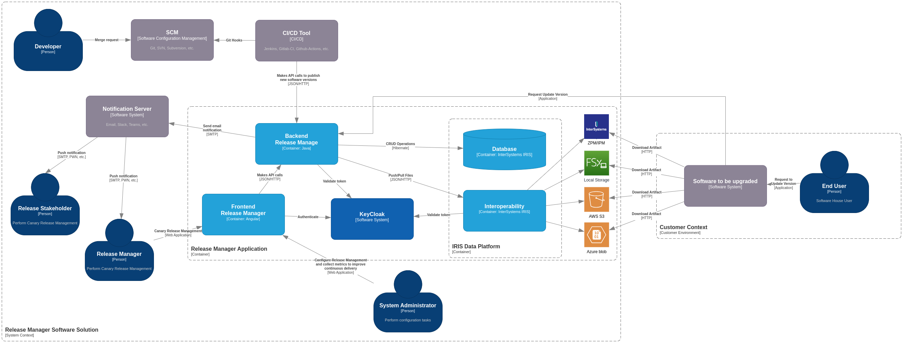

# Release Manager

## Context

Release Manager is a tool to manage software release to the market using Canary Release methodology.

We understand Canary Release as defined in [Martin Fowler’s](https://martinfowler.com/) blog from ThoughtWorks called [“Canary Release” by Danilo Sato.](https://martinfowler.com/bliki/CanaryRelease.html)

> **Canary release** is a technique to reduce the risk of introducing a new software version in production by slowly 
> rolling out the change to a small subset of users before rolling it out to the entire infrastructure and making it 
> available to everybody. 

Although we have cloud-based customers, we also have on premises too, so we need to be expanded the word “infrastructure” from the definition above, to fit in our solution.

## Business Problem

Given that a software development team wants to release features to the market, in a Canary Release way, we have come up with the Event Storming below.


## Business Solution

Facing a DevOps challenge, that pinpoint key stages of the process, we selected only those one that can help provide metrics of improvement, as the DevOps mindset is all about Agile development methodology, and there are maturity models like [DORA](https://dora.dev/research/), that can be used.

Mostly we want to help measure and improve one of the [Four Key Metrics](https://cloud.google.com/blog/products/devops-sre/using-the-four-keys-to-measure-your-devops-performance), the **Deployment frequency**, which stands for: How often does your organization deploy code to production or release it to end users?

The key thing about these metric that we wanna to state is that, we have to measure delivery failures to be able to improve, not just how often we delivery, but how often we deliver with quality, focusing on the reduction of the number of times a version doesn’t go up to the promotion of general availability.

There are five status that a product version can be promoted by the release manager role, a person with this specific authority.

### Version Status

1. Internal: The development team is asking to go to market
2. Canary: The release manager role is promoting that version to a subset of customers
3. GA - General Availability: The release manager role is promoting a version to all customers
4. Revoked: The release manager role found problems on a given version and will not promote it to the market
5. Deprecated: The release manager role is removing a given product version from the market as it reached its end of life phase, and there is a new major version available to the market.

For that, we want to register metrics like:

- Frequency of delivery.
- Frequency of Internal versions that are not promoted to Canary.
- Frequency of Canary versions that are not promoted to General Availability.
- Successful Deployment by Product
- Deployments In Progress
- Median Download Time Interval by Customers
- Median Deployment Time Interval by Customers
- Etc.

## Architectural Solution

### System Context



The diagram above, shows the system context using the C4 modeling notation. Here we present the high level context for the solution landscape.

There are five basic roles involved, starting with the developer and ending with the user that needs its software to be upgraded.

Along the way, there are the Release Manager role, in which have the authority to promote the version status as described in [Version Status section](#Version%20Status). There are, also, any stakeholder interested in been notified about version status promotion. And finally a system administrator who have the authority to change the system configuration.

For external system involved with this solution we have the SCM Git repository, or any other form of SCM - Software Configuration Management, CI/CD tools, that perform the delivery to this system.

Hence, the Release Manager solution is a delivery system.

## podman Network

Create the podman network.

```bash
podman network create release-manager-net
```

## Postgres Database and pgAdmin

Spin up the database by running the podman-compose file.

```bash
podman compose up -d
```

# Java Backend

This project uses Quarkus, the Supersonic Subatomic Java Framework. A Kubernetes Native Java stack tailored for OpenJDK HotSpot and GraalVM, crafted from the best of breed Java libraries and standards.

If you want to learn more about Quarkus, please visit its website: https://quarkus.io/ .

To know more details on running this project, go to [backend](./backend/README.md).

## Configuration

Before starting the Java backend, you need to inform what it is your database password to it.

You can provide it on the property `quarkus.datasource.password` in the `application.properties` file located at `src/main/resources`, or the environment variable `QUARKUS_DATASOURCE_PASSWORD` if you use the podman image.

## Running the Backend in Dev Mode

### Prepare dependencies

This application was built using [Apache Maven 3.9.5](https://maven.apache.org/download.cgi) and [Java 21](https://javaalmanac.io/jdk/21/).

We recommend using [SDK Man](https://sdkman.io/). After installing SDK Man, you can install a Java 17 distribution, Maven and Quarkus CLI.

```bash
sdk install maven
sdk install java 21.0.7-amzn
sdk install quarkus
```

You can run the application in dev mode using Quarkus CLI:

```bash
cd backend
quarkus dev
```

You can run the application in dev mode using Maven:

```bash
cd backend
./mvnw compile quarkus:dev
```

Quarkus ships with a Dev UI, which is available in dev mode only at http://localhost:8080/q/dev/. There, you can 
explore all extensions and configurations of the application.

If you're more of a curl person, then run:

```bash
curl http://localhost:8080/q/health
```

If you're more of a [HTTPie](https://httpie.io/cli) person, then run:

```bash
http :8080/q/health
```

## Packaging the application in container

The application can be packaged for containers using:

```bash
mvn package -Dquarkus.container-image.build=true
```

```bash
podman run --rm --name release-manager-backend \
  --network=release-manager-net \
  -p 8080:8080 \
  --env QUARKUS_DATASOURCE_JDBC_URL=jdbc:postgresql://release-manager-db:5432/release_manager \
  --env QUARKUS_DATASOURCE_PASSWORD=password \
  release-manager/backend:latest
```

## Playing with the application

Nether way, by running in dev mode or running the container image, now you can play around with the application by 
accessing the main page at http://localhost:8080/

There, you will find the notification panel, and a link to the [Swagger-UI](http://localhost:8080/q/swagger-ui/), where you can send HTTP requests 
and observe the notification panel react using [SSE - Serven-Sent Events](https://developer.mozilla.org/en-US/docs/Web/API/Server-sent_events).
